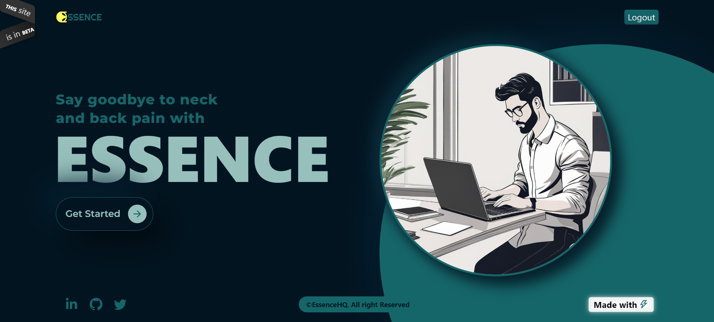
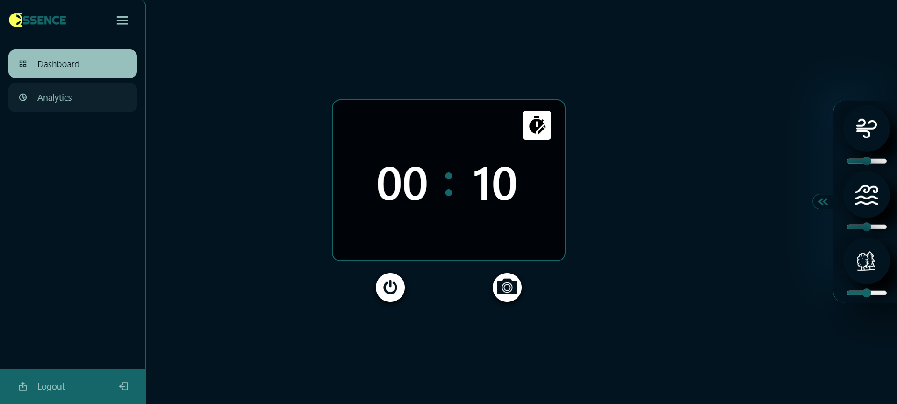
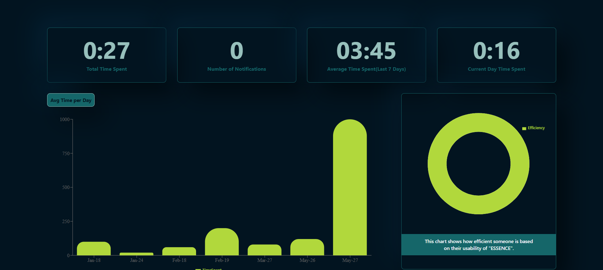

# Essence

Essence is an app for the most essential thing in your life🏃 **your health**🏃‍♂️.

## Features

Things that make Essence an essential part of a software developer's life👩‍💻

📌It tracks your posture using Tensorflow every few minutes and gives you a warning if you are slouching🙆‍♂️

📌You can set daily targets to work on your PC🎯

📌 Get points for maintaining proper posture and achieving your daily goals💲

📌 You can track your past progress: How proper was your posture? When you procrastinate and are unable to check your daily target📝

📌 Like listening to ambient sounds while working? We've got you covered. Essence has built-in support for multiple different ambient sounds on your dashboard🎶

> ### Be mindful of the most essential thing in your life while you work on building your next crazy idea💫

**Note:** Essence is currently under development. We are working very hard on it and it'll be up and running before you _git init_ your next project. Until then please feel free to tinker around with the public codebase✌️

## Screen Previews

<blockquote><b><i>home page</i></b></blockquote>



<blockquote><b><i>dashboard</i></b></blockquote>



<blockquote><b><i>stats page</i></b></blockquote>



Try out the beta live - [ESSENCE-WEB](https://essence-sage.vercel.app/home)

<blockquote><i>The issue with the live link will be resolve soon.</i></blockquote>

## Technology Used:

1. **ReactJS**
2. **NodeJS**
3. **express.js**
4. **MongoDB**
5. **TensorflowJS(posenet model)**
6. **TailwindCSS**

## Getting Started

1. Clone both the repository to your local machine:
   > front-end

```bash
git clone https://github.com/ParamPragyan/ESSENCE.git
```

> back-end

```bash
git clone https://github.com/ParamPragyan/ESSENCE-backend.git
```

2. Navigate to the project's directory:

```bash
cd essence-frontend
cd essence-backend
```

3. Install dependencies using 
>yarn(frontend):
```bash
yarn
```
>npm(backend):
```bash
npm install
```

<br>

## Running the App

To run the app in development mode, use the following command in both the repository:

> frontend

```bash
yarn dev
```

> backend

```bash
nodemon server.js
```

<br>

## Credentials:

```bash
login: user111@gmail.com
password: 123456
```
