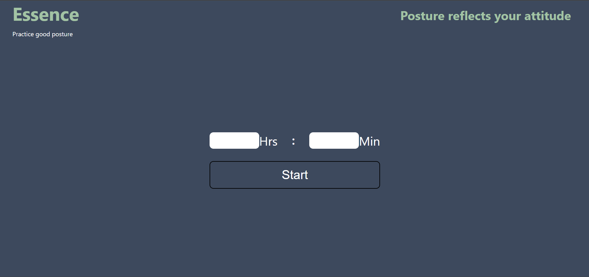

# Essence

A tool to keep you healthy while you work on your project.

This app is bootstrapped using [create react app](https://github.com/facebook/create-react-app)

## How to use Essence?

Clone the project in your system and change the directory to the cloned one using the command:

`git clone`

change the directory to essence

`cd essence`

To run the app use:

1. `npm install`
2. `npm start`

### Packages Used:

In _Essence_ we have used following packages:

- Tensorflow.js

  npm i @tensorflow/tfjs

- Tensorflow-models/posenet;

  npm i @tensorflow/tfjs

- React-Webcam;

  npm i react-webcamp

## What is Essence?

Essence is an app used to keep your body posture correct while you work on your PCs and Laptops.

It uses Tensorflow.js and your system's web cam to analyze your sitting body posture.

If the user will slouch for more than 10s the app will send desktop notification to the user to correct their body posture.

## Technologies Used:

- React.js
- Tensorflow.js

## Made by:

- [Param Pragyan](https://github.com/ParamPragyan)
- [Susaksham Jain](https://twitter.com/Susaksham08)

